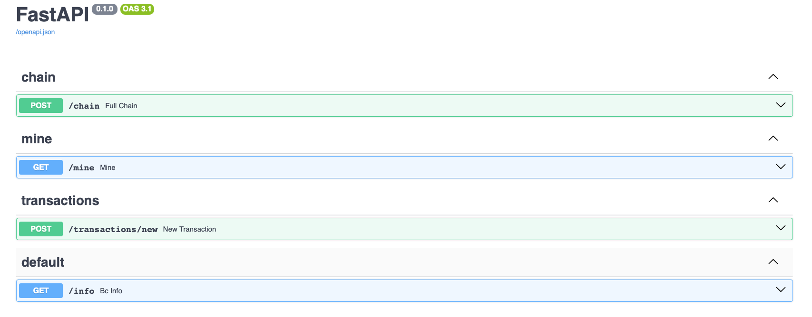

# learning-blockchain-python
## Version: 0.1

> inspired by guide on hackeroon.com ([link](https://hackernoon.com/learn-blockchains-by-building-one-117428612f46))

Small project to test blockchain with my own hands and have some chatgpt-generated code detox 😔.

### Blockchain overview

The main idea of blockchain as I understand it - to have the whole world solve mathematical problems to create proofs of some operations and get reward for computing it. If you try to create *impostor block* you'll need to overcompute everyone else who tries to compute that (practically impossible).

Key characteristics:
- **Decentralized**: copies of the ledger are distributed across the network
- **Distributed**: all users can access the same, up-to-date ledger
- **Immutable**: once a block is added to the chain, it cannot be altered, deleted, destroyed without notice from the whole network
- **Transparent**: transactions are publicly viewable

The whole process can be described somehow like this:
```
Transaction created -> Block created (Transaction into it) -> Validate (using PoW) -> Chaining (block added to previous) -> Distribution (shared across network)
```

**Transaction** - a simple record of transferring an asset or data from one member to another.

**Block** - a structure containing sender, recepient, timestanm and *hash of the previous Block*
```json
{
  "index": 1,
  "timestamp": 1506057125.900785,
  "transactions": [
    {
      "sender": "8527147fe1f5426f9dd545de4b27ee00",
      "recipient": "a77f5cdfa2934df3954a5c7c7da5df1f",
      "amount": 5
    }
  ],
  "proof": 324984774000,
  "previous_hash": "2cf24dba5fb0a30e26e83b2ac5b9e29e1b161e5c1fa7425e73043362938b9824"
}
```

**Chain** - a group of *blocks*, combined together and next one referencing previous.


#### Proof of work

The goal is to discover a number which solves a problem. This number must be **difficult to fund but easy to verify**. For example *haswh of (x * y) must end with '0'*: `hash(x * y) = ac23dc...0`.
If we fix `x=5` then we need to find `y` like this:
```python
from hashlib import sha256
x = 5
y = 0  # We don't know what y should be yet...
while sha256(f'{x*y}'.encode()).hexdigest()[-1] != "0":
    y += 1
print(f'The solution is y = {y}')
```
The solution is `21`: `hash(5 * 21) = 1253e9373e...5e3600155e860`

In BTC the Proof of Work algorithm is [Hashcash](https://en.wikipedia.org/wiki/Hashcash?ref=hackernoon.com). The more symbols you have to guess, the harder it is to get the block.

### API 

In guide api server is implemented in Flask, but I prefer FastAPI(+SQLModel in future), so be it.


> endpoint description can be accessed at `/docs` page

##### /chain

Endpoint that shows full chain and it's length, the same as it was in source guide.
Output example:
```json
{
  "chain": [
    {
      "index": 1,
      "timestamp": 1756113482.71595,
      "transactions": [],
      "proof": 100,
      "previous_hash": "1"
    },
    {
      "index": 2,
      "timestamp": 1756113675.6435468,
      "transactions": [
        {
          "sender": "101",
          "recipient": "102",
          "amount": 10
        },
        {
          "sender": "0",
          "recipient": "24c8c8bcffec45deb61ec197c1180459",
          "amount": 1
        }
      ],
      "proof": 35293,
      "previous_hash": "1ff9092cbe6379a33290ed2100e07a73be02db6d6ccb31a6007adbec7885151c"
    }
  ],
  "length": 2
}
```

##### /mine

Mine block, solve problem to find number to have hash = "...0000" and add it into Chain (and get reward ofc)
Example output:
```json
{
  "chain": [
    {
      "index": 1,
      "timestamp": 1756113482.71595,
      "transactions": [],
      "proof": 100,
      "previous_hash": "1"
    },
    {
      "index": 2,
      "timestamp": 1756113675.6435468,
      "transactions": [
        {
          "sender": "101",
          "recipient": "102",
          "amount": 10
        },
        {
          "sender": "0",
          "recipient": "24c8c8bcffec45deb61ec197c1180459",
          "amount": 1
        }
      ],
      "proof": 35293,
      "previous_hash": "1ff9092cbe6379a33290ed2100e07a73be02db6d6ccb31a6007adbec7885151c"
    }
  ],
  "length": 2
}
```

##### /transactions/new

Add new transaction into current (unmined) Block, it'll be added to chain after mining the corresponding block.
Example output:
```json
{
  "message": "Transaction will be added to Block #2"
}
```

##### /info

Enhanced version of `/chain` endpoint, shows full info if Blockchain class instance.
Example output:
```json
{
  "id": "24c8c8bcffec45deb61ec197c1180459",
  "chain_length": 2,
  "last_chain_elem": {
    "index": 2,
    "timestamp": 1756113675.6435468,
    "transactions": [
      {
        "sender": "101",
        "recipient": "102",
        "amount": 10
      },
      {
        "sender": "0",
        "recipient": "24c8c8bcffec45deb61ec197c1180459",
        "amount": 1
      }
    ],
    "proof": 35293,
    "previous_hash": "1ff9092cbe6379a33290ed2100e07a73be02db6d6ccb31a6007adbec7885151c"
  },
  "transaction_length": 0,
  "transactions": []
}
```

### Install/Start

First install dependencies for that project into venv:
```bash
# you can use python3.XX version instead, I used 3.12
python3 -m venv .venv
source .venv/bin/activate
pip install -r requirements.txt
```

Next you need to start FastAPI application, you can run it in development mode with hot-reload:
```bash
uvicorn --host 127.0.0.1 --port 8080 --reload src.main:app
```

In current version of project it is impossible to use workers (threads) because it creates independent class instance for each thread, what breaks the logic of whole application.

### TODO

- [X] Add LOCK mechanism for class. In case of race-condition while running multiple workers (see `threading.Lock`)
> simple locks added for class methods, but it doesn't help with threading. For each thread another class instance is created and locks doesn't help.
- [ ] Add Celery/RabbitMQ for cpu-expensive operations like mining new block
- [ ] Add DB (PostgreSQL/Redis) to avoid racing between workers
- [ ] Implement Docker deployment to run with only one command
- [ ] Add poetry installation
- [ ] ...

| once I'd like to create BTC-like blockchain. Need to learn `mempool, competing nodes, sending blocks/transactions over p2p, the "highest cumulative complexity" rule, and the delay in coinbase spending`